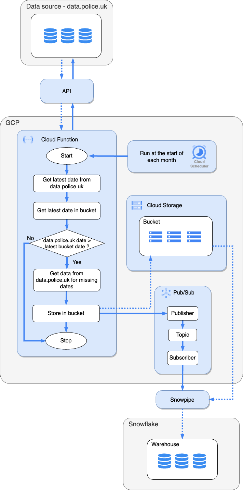

# Crime Data UK - Data Pipeline and Analysis

## Data Pipeline
The figure below shows the data pipeline for ingesting and processing street-level crime data from Police UK. I decided to bulk ingest data using this link 'https://data.police.uk/data/archive/latest.zip' rather than using the API for the following reasons:
* You must specify a specific point in latitude and longitude, along with the year-month. Another option would be to specify the area/perimeter of where we want data from, but this is limited to 10,000 records, which again is not suitable.
* The amount of data is not that large (1.5 GB) and only needs downloading once per month.

As the batch is extracted at such a low frequency, I decided to use a Cloud Function to load the data into a Cloud Storage bucket. One limitation of the cloud function is timeouts only lasting for a maximum of 9 minutes. An alternative would be to use Cloud Run as this provides more flexibility.
Cloud scheduler was used to schedule the Cloud Function to run at the start of each month, with cron notation.
As the project requirements prefer the use of Snowflake to store the data, I created a [Snowpipe](sql/snowpipe_setup.sql) that is subscribed to a topic that is triggered when files drop into the Cloud Storage bucket.
Then we can query the Cloud Storage data from our Snowflake warehouse and merge it into a table.

  

    <strong>Figure 1:</strong> Data pipeline to ingest and process open source data from data.police.uk.

## Schema
I used strings for all columns, except latitude and longitude which are numeric with a defined scale and precision. For the primary key I wanted to use a hash function to generate a unique ID for each row, but too many fields had null values. Therefore, I opted for the STRING_UUID() function to assign each row with a unique ID.

## Data Analysis
I have assumed the LSOA code provides enough granularity to get an idea of the level of crime commmited at a street level. Another lookup table linking LSOA code to post code would also be useful. The queries shown in [this](sql/street_level_crime_analysis.sql) SQL file shows the logic to summarise the monthly crime data by type at a street level.

## Run from command line
Publish Pub/Sub message to invoke Cloud Function: `gcloud pubsub topics publish run-cloud-fun-topic --message='{"months": ["2022-12", "2022-10", "2022-07"], "data_sets": ["street", "stop-and-search"]}'`

Check Cloud Function logs: `gcloud beta functions logs read batch-load-crime-data-fn --gen2`

Run tests: `python -m pytest tests/test_local_unit_tests.py`